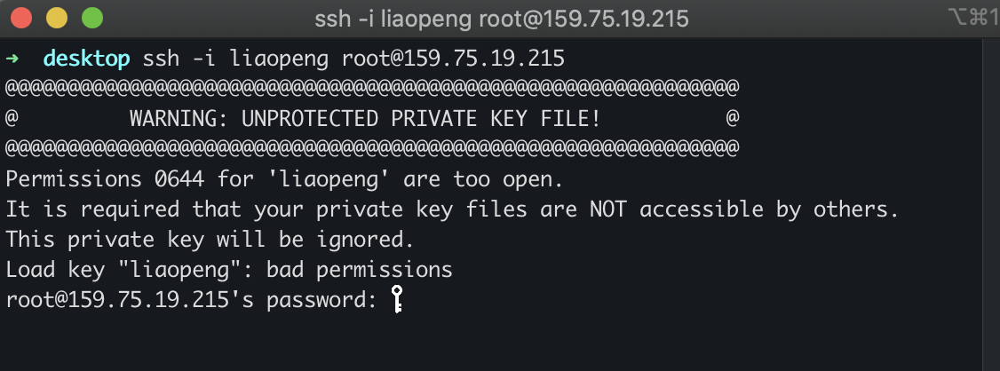
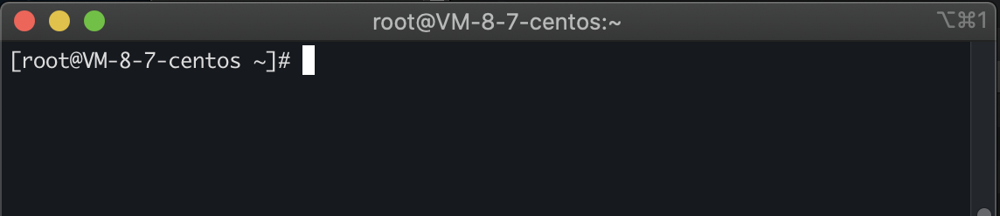

# 小记

1. 相关文档链接
> [官方文档链接](https://cloud.tencent.com/document/product/1207/44643)
> [出现`WARNING: REMOTE HOST IDENTIFICATION HAS CHANGED!`解决办法](https://blog.csdn.net/xlgen157387/article/details/52669709)

2. 我的操作步骤
> 1. 先创建自己的`ssh密钥`，这个密钥用一次就好了，我把它下载后放在桌面上的
> 
> 2. cd 到你密钥存放的位置 `ssh -i liaopeng(密钥文件名) root@159.75.19.215`，这里如果报以下错，参照文档链接2
> 
> 3. 如果正常的话，这里会让输入密码，密码就是之前的root密码，服务器的用户名就是root，密码就是root的密码，成功后如下
> 
> 4. 退出的话，命令行输入 `exit`就好了
> 5. 下次再登录时，直接命令行输入 `ssh root@159.75.19.215`就好了

